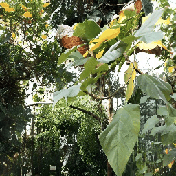

https://github.com/superdianuj/ESRGAN/assets/47445756/113ca628-ff41-4937-aaa8-6d878c55fc58
<p align="center">
  
</p>

## 🔧 Dependencies and Installation

- Python >= 3.7 (Recommend to use [Anaconda](https://www.anaconda.com/download/#linux) or [Miniconda](https://docs.conda.io/en/latest/miniconda.html))
- [PyTorch >= 1.7](https://pytorch.org/)

### Installation

1. Clone repo

    ```bash
    git clone https://github.com/xinntao/Real-ESRGAN.git
    cd Real-ESRGAN
    ```

1. Install dependent packages

    ```bash
    # Install basicsr - https://github.com/xinntao/BasicSR
    # We use BasicSR for both training and inference
    pip install basicsr
    # facexlib and gfpgan are for face enhancement
    pip install facexlib
    pip install gfpgan
    pip install -r requirements.txt
    python setup.py develop
    ```

---

## Inference


### Python script

#### Usage of python script

1. You can use X4 model for **arbitrary output size** with the argument `outscale`. The program will further perform cheap resize operation after the Real-ESRGAN output.

```console
Usage: python inference_realesrgan.py -n RealESRGAN_x4plus -i infile -o outfile [options]...

A common command: python inference_realesrgan.py -n RealESRGAN_x4plus -i infile --outscale 3.5 --face_enhance

  -h                   show this help
  -i --input           Input image or folder. Default: inputs
  -o --output          Output folder. Default: results
  -n --model_name      Model name. Default: RealESRGAN_x4plus
  -s, --outscale       The final upsampling scale of the image. Default: 4
  --suffix             Suffix of the restored image. Default: out
  -t, --tile           Tile size, 0 for no tile during testing. Default: 0
  --face_enhance       Whether to use GFPGAN to enhance face. Default: False
  --fp32               Use fp32 precision during inference. Default: fp16 (half precision).
  --ext                Image extension. Options: auto | jpg | png, auto means using the same extension as inputs. Default: auto
```

#### Inference on Single Image

Download pre-trained models: [RealESRGAN_x4plus.pth](https://github.com/xinntao/Real-ESRGAN/releases/download/v0.1.0/RealESRGAN_x4plus.pth)

```bash
wget https://github.com/xinntao/Real-ESRGAN/releases/download/v0.1.0/RealESRGAN_x4plus.pth -P weights
```

Inference

```bash
python inference_realesrgan.py -n RealESRGAN_x4plus -i <path to image> --face_enhance 1
```

Results are in the `results` folder


#### Inference on Dataset

Download pre-trained models: [RealESRGAN_x4plus.pth](https://github.com/xinntao/Real-ESRGAN/releases/download/v0.1.0/RealESRGAN_x4plus.pth)

```bash
wget https://github.com/xinntao/Real-ESRGAN/releases/download/v0.1.0/RealESRGAN_x4plus.pth -P weights
```

Inference

```bash
python dataset_inference.py --dir <dataset_folder_name>
```

COLMAP Dense Reconstruction
```bash
python colmap_runner.py --path <name of folder containing images> --project_name <name of associaed colmap project>
python visualize_mesh_and_pointcloud.py --path <name of associaed colmap project>
```


### Case Results

|Case | Ref Image | Pretrained ESRGAN Predictions |
|-----|-----------|-------------------------------|
|1    |  |  |
|2    |  |  |
|3    |  |  |
|4    |  |  |
|5    |  |  |
|6    |  |  |


|Case | Ref Dataset | Pretrained ESRGAN Predictions |
|---------|------------------|------------------|
|1| <br>Synthetic Motion Blurred | <br>Prediction |
|2| <br>Synthetic Resolution Blurred | <br>Prediction |


#### Ref Dataset COLMAP Reconstruction


https://github.com/superdianuj/ESRGAN/assets/47445756/42958f7e-12a0-43e5-a6ee-a4efbf99603f

#### Pretrained ESRGAN Predictions COLMAP Reconstruction


https://github.com/superdianuj/ESRGAN/assets/47445756/355670b6-1ffb-44f2-86f1-1e8fedb88b4a


#### Ref Dataset COLMAP Reconstruction

https://github.com/superdianuj/ESRGAN/assets/47445756/328661d8-fad6-4bcc-87bf-edbdcf1d0098

#### Pretrained ESRGAN Predictions COLMAP Reconstruction


https://github.com/superdianuj/ESRGAN/assets/47445756/0c0889fd-70d0-4d67-aae7-668617be29ef


